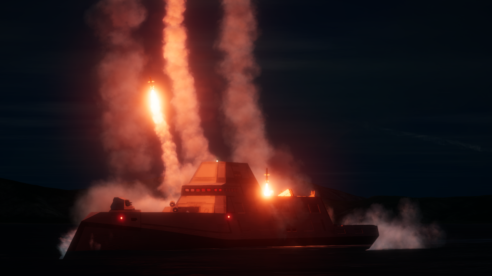
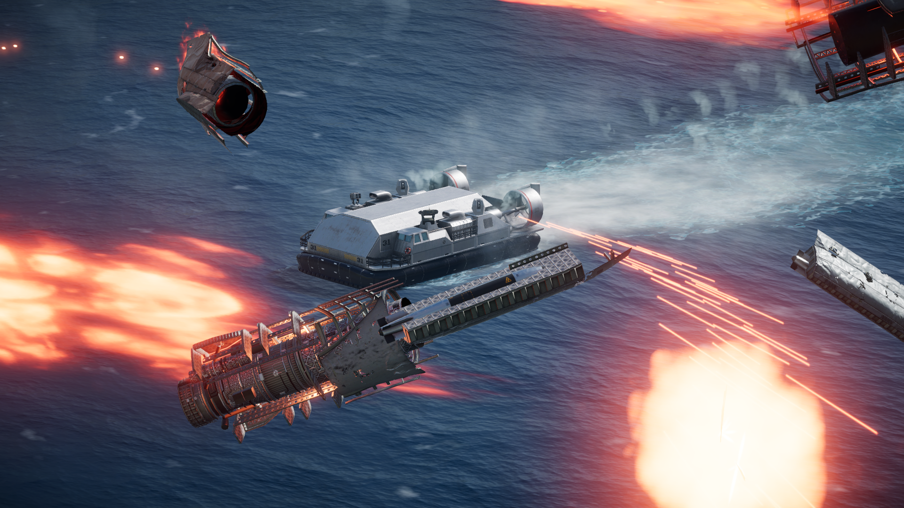
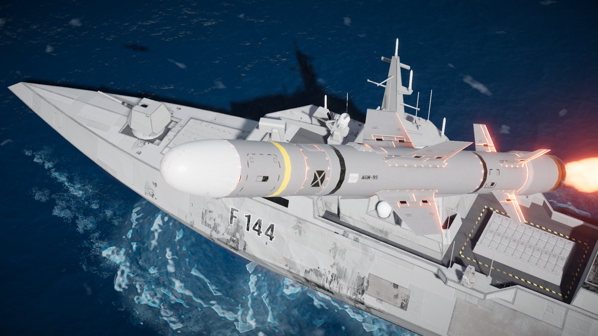
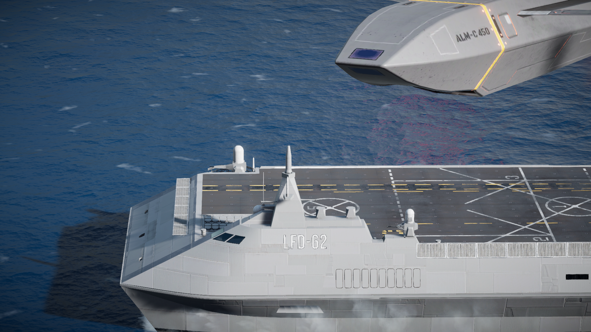

# Boscali Ocean Training Exercise (BOTE)

*A comprehensive surface vessels mod for Nuclear Option.*

[UPDATE 1.5.0 Released!](UPDATE.md)

## Features
- Player controllable ships, currently includes all base game ships as of the 0.34 update:
  - OTB-31 Landing Craft
  - Surf class Patrol *Bote*
  - Shard class Corvette
  - Argus class Frigate
  - Dynamo class Destroyer
  - Cursor class Littoral Flight Deck
  - Annex class Assault Carrier
  - Hyperion class Fleet Carrier
- Systems for controlling the ships
  - BOTE Exclusive Radial Menu 
  - Additional keybinds under controls menu > BOTE
- Advanced features for certain ships
  - Most ships (excluding Surf and Shard) can deploy units of some times, be it helicopters, aircraft, or, for the OTB-31, ground vehicles.
  - The OTB-31 Also includes an advanced FOB building system that allows players to build a forward operating base capable of deploying aircraft.
- Custom HUD Elements
  - Information about resupply, vehicle deployment, and if it is safe to eject from the ship.
- As well as many more features...

## Troubleshooting (Common Issues)
- Mod doesn't load
  - Make sure [Blueprinter](https://github.com/nikkorap/NOBlueprinter-Releases/releases/latest) is installed
- LCAC cannot move
  - Unlike the other ships, the LCAC uses Ibis controls for its throttle because of the ducted fans, and yaw for steering only
- Custom inputs don't work
  - Open ConfigManager with f1 (make sure it is installed), find BoscaliOceanTrainingExercise_Inputs, and click the reset button. This will not reset your keybindings.

## Showcase Images (Loading Screens):

