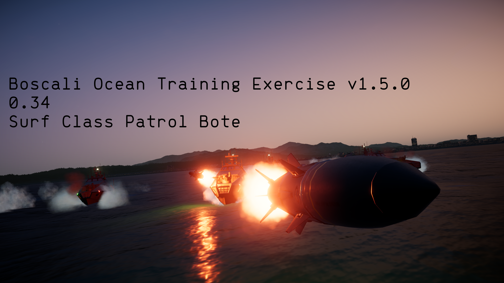

# Boscali Ocean Training Exercise (BOTE) v1.5.0

## 0.34 Compatibility
### New Features:
- Surf class Patrol *Bote*
  - The return of the SSM-114P Shipbreaker, as well as multiple new weapons exclusive to the Surf class
  - (Currently) Exclusive smoke launching system, used to block line of sight for optical and laser missiles, as well as sensors
- Revamped input system to fix binding issues
- New BOTE radial sub-menu for controller players, or if you dont want to bind everything
  - Configuration: Auto reset to main radial menu (true/false)
- A multitude of small bug fixes and reworking of certain systems to (hopefully) reduce issues
- And more!